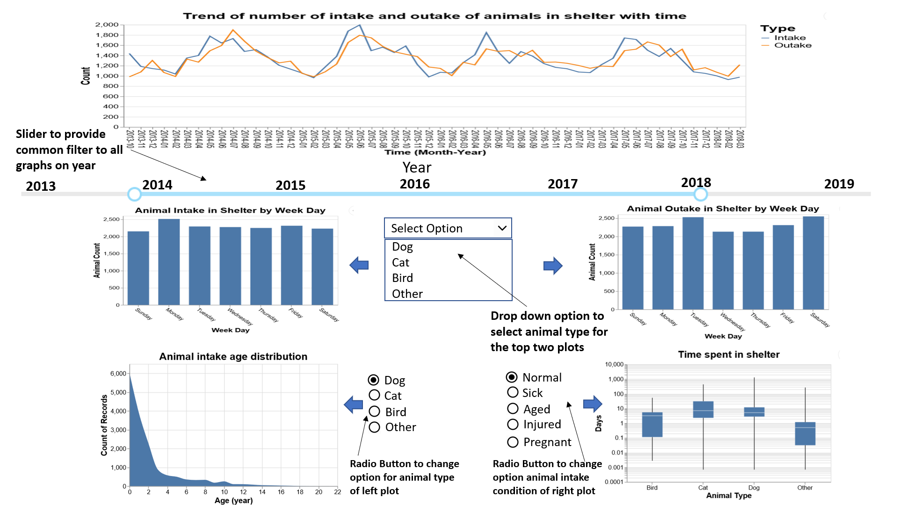

# DSCI_532_L02_group206_ms1
Milestone 1 Repository - Dashboard in Python with Altair

Our team's proposed app is targeted at shelter staff, and aims to provide users with salient insights behind Austin Animal Shelter. By using our app, they can make informed decisions about their operational planning and budgeting, and ensure the sustainability of the shelter.

 

The app brings the user to a full view of 5 charts relevant to the animal intake and outtake at Austin Animal Shelter. Each graph is summarised below:

- The 1st plot is a general line chart plotting the overall Intake and Outtake counts for the animal shelter across the relevant years (2013 to 2018) on a monthly basis

- A general common filter is located next which applies to all 5 plots:
    - Range of Year via __RangeSlider__

- Plots 2 and 3 are bar charts representing the “Average Pets Intake and Outtake Counts per Weekday”. Both graphs share common filters as per:
    - Animal Type (ie Cat, Dog, All etc) via __Drop list__ selection

- The 4th plot is a histogram chart representing the “Intake Age Distribution” for each animal type. Each animal’s histogram will be overlayed on top of each other with translucent opacity. 
    - Inclusion/exclusion of Animal Type (Cat, Dog, etc) can be done via __Radio buttons__

- The 5th plot is a boxplot chart representing the “Time Spent in Shelter (Days)” for all animal types. This can be further filtered by:
    - Health Condition at Intake (Healthy, Injured, Aged, Sick, Feral, Pregnant, Nursing, Other) via __Radio Buttons__

With the first graph, it provides a simple metric tracking of animal intakes and outtakes per year, which may indicate a macro trend in terms of animal rescues, abandonment, and adoption. Since the charts are on a monthly breakdown, it also helps depict any possible seasonal trends within each year. The next 2 charts provide the user information about specific animal average intake and outtake counts for weekdays so it is easy to understand the workload/resource requirements on a daily impact. The 4th graph allows for quick comparison of age distribution across varying animal intakes. The 5th graph presents the time spent in the shelter before outtake for each animal type, which highlights to the user which animals may need more help in terms of matching to possible adoption owners. 

